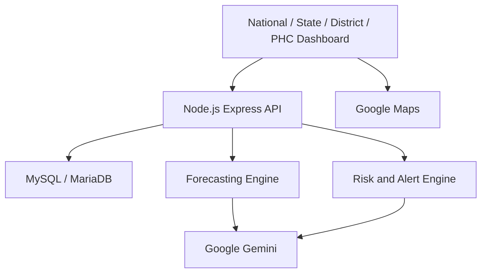

# Bharat Health Grid

AI-Powered Federated Health Resource Intelligence for India

Bharat Health Grid (BHG) is an operational intelligence dashboard for India's Primary Health Centre (PHC) network. It shows medicine stock, beds, staff attendance, and patient visits from state to facility, then forecasts short-term demand and explains the result with Google Gemini. Recommendations stay with a human. The system does not move stock on its own.

## Problem

Public healthcare systems can face supply-chain and resource visibility challenges across PHCs.

Bharat Health Grid provides a unified operational intelligence layer for:

- Medicine stock
- Bed availability
- Medical personnel attendance
- Patient footfall
- Demand forecasting
- Early stock-out warnings
- Emergency resource pressure
- Cross-district redistribution recommendations
- AI-assisted operational analysis

## Solution

BHG gives one drill-down path through the network:

India → State → District → PHC

National, state, district, and facility views read the same operational records. The server calculates forecasts and alerts from that data. Google Gemini then explains the supplied results. It does not invent the stock-day math and it does not change the database.

The included dataset is realistic demonstration data for a hackathon, not a live government feed.

## Core Features

1. National PHC Resource Dashboard
2. State / District / PHC drill-down
3. Medicine stock intelligence
4. Bed utilization
5. Personnel attendance
6. Patient footfall analytics
7. National PHC Map
8. Demand forecasting
9. Early stock-out warnings
10. Emergency response simulation
11. Cross-district redistribution recommendations
12. Gemini AI operational analysis
13. Human approval before operational action

## AI Architecture

```text
Database
    ↓
Deterministic analytics / forecasting
    ↓
Risk detection
    ↓
Google Gemini
    ↓
Operational explanation and recommendations
    ↓
Human approval
```

Forecasting is calculated on the server from historical footfall and current stock. Gemini does not perform that math. It receives the calculated operational data and returns an explanation and recommended actions. A person must approve any real-world action. No AI route updates medicine stock, beds, personnel, or patient records.

## Google AI Integration

BHG uses the Google Gemini API for:

- Resource risk analysis
- Redistribution analysis
- Natural-language PHC queries
- Forecast analysis
- Emergency simulation analysis

Each call sends supplied operational data. Gemini does not connect to the database and does not modify operational records. If the API key is missing or the service is busy, the dashboard stays available and shows a short message.

## Forecasting

The forecast service uses the latest 30 days of recorded patient footfall for each PHC.

- Recent 7-day average, used as the short-term demand baseline
- Previous 7-day average
- Trend percentage between those two averages
- 7-day visit forecast, equal to the recent daily average times 7
- Medicine stock days, equal to current stock divided by current daily usage
- Forecast stock-out alerts when projected days of supply fall inside the bands below

Medicine forecast risk:

| Risk | Stock remaining |
| --- | --- |
| CRITICAL | 3 days or less |
| HIGH | 7 days or less |
| MEDIUM | 14 days or less |
| LOW | 30 days or less |
| HEALTHY | more than 30 days |

A footfall spike alert is raised only when both 7-day windows exist. A rise of 20% or more is HIGH. A rise of 40% or more is CRITICAL.

## Emergency Response Simulation

The national dashboard includes an Acute Respiratory Outbreak scenario. Demand can be raised by +10%, +25%, +50%, or +100% over a fixed 7-day horizon.

The simulation scales recorded daily visits and medicine use by that increase, then estimates bed pressure as 5% of the additional visits. Projected occupied beds cannot exceed the PHC's real bed total. Staff status stays on the latest attendance record. Where a simulated medicine shortage meets excess stock of the same medicine elsewhere, the screen shows a redistribution opportunity.

Gemini can explain the simulation after you click **Analyze Emergency with Gemini**.

Simulation only — no live operational database records are modified.

## Redistribution

The system looks for the same medicine in excess at one PHC and under pressure at another. It recommends a quantity. It does not update `medicine_stock`.

Example from the seeded data:

Pattukkottai → Sulur, Paracetamol

The recommendation is labelled as waiting for human approval. No transfer is executed.

## Data

The project uses realistic seeded operational data for demonstration. It is not live government data.

Current seeded scale:

- 6 states
- 18 districts
- 20 PHCs
- 12 medicines
- 241 medicine stock rows
- 20 bed records
- 120 personnel records
- 1,200 attendance records
- 600 patient footfall records

Load it from `database/schema.sql`. Re-running that script drops and recreates `bharat_health_grid`.

## Technology Stack

Frontend:

- React
- Vite
- JavaScript
- Ant Design
- Recharts
- Google Maps

Backend:

- Node.js
- Express
- MySQL/MariaDB

AI:

- Google Gemini API

Development:

- Cursor
- XAMPP

## Architecture



The browser calls the Express API. Forecasting and alerts run inside that API and read MariaDB. Gemini is called only from the API, using results already calculated from the database. Google Maps is loaded in the browser for the national PHC map. More detail is in [docs/architecture.md](docs/architecture.md).

## API Overview

Base URL: `http://localhost:5000/api`

| Method | Path |
| --- | --- |
| GET | `/api/health` |
| POST | `/api/auth/login` |
| GET | `/api/auth/me` |
| GET | `/api/phcs` |
| GET | `/api/medicine-stock` |
| GET | `/api/beds` |
| GET | `/api/personnel` |
| GET | `/api/personnel-attendance` |
| GET | `/api/patient-footfall` |
| GET | `/api/alerts` |
| GET | `/api/analytics/state-summary` |
| GET | `/api/analytics/phc-summary/:phcId` |
| GET | `/api/analytics/forecast` |
| GET | `/api/analytics/medicine-forecast` |
| GET | `/api/analytics/forecast-alerts` |
| POST | `/api/analytics/emergency-simulation` |
| POST | `/api/ai/resource-risk-analysis` |
| POST | `/api/ai/redistribution-recommendations` |
| POST | `/api/ai/query` |
| POST | `/api/ai/forecast-analysis` |
| POST | `/api/ai/emergency-analysis` |
| POST | `/api/redistribution/approve` |

Operational routes require `Authorization: Bearer <token>`. `/api/health` and `/api/auth/login` stay public. The signed-in role and scope are taken from the token, then checked against the database user. A state, district, or PHC outside that scope is rejected.

Successful responses use `{ "success": true, "data": ... }`. Errors use `{ "success": false, "message": "..." }`.

## Setup

Requirements: Node.js 22 or later, and MariaDB or MySQL. This project was developed with XAMPP.

1. Start XAMPP MariaDB.
2. Create and load the database:

```bash
mysql -u root -p < database/schema.sql
```

On a default XAMPP install the client is often:

```bash
C:\xampp\mysql\bin\mysql.exe -u root < database/schema.sql
```

Then load the demo logins:

```bash
C:\xampp\mysql\bin\mysql.exe -u root < database/seed_users.sql
```

3. Configure the API. Copy `server/.env.example` to `server/.env` and set:

```text
DB_HOST
DB_PORT
DB_USER
DB_PASSWORD
DB_NAME
GEMINI_API_KEY
JWT_SECRET
```

`PORT` and `CLIENT_ORIGIN` are also read. They default to `5000` and `http://localhost:5173`. `JWT_SECRET` must be a long random value. Do not commit it.

4. Configure the dashboard. Copy `client/.env.example` to `client/.env` and set:

```text
VITE_API_BASE_URL
VITE_GOOGLE_MAPS_API_KEY
```

`VITE_API_BASE_URL` should be `http://localhost:5000/api`. Leave the Maps key blank to run without a map.

5. Start the backend:

```bash
cd server
npm install
npm start
```

6. Start the frontend:

```bash
cd client
npm install
npm run dev
```

Open [http://localhost:5173](http://localhost:5173). The app starts at the login page. Restart Vite after changing `client/.env`, because Vite reads those variables at startup.

Demo logins, all using password `BHG@12345`:

| Username | Role | Scope |
| --- | --- | --- |
| `national.admin` | National admin | India |
| `tn.admin` | State admin | Tamil Nadu |
| `coimbatore.officer` | District officer | Coimbatore |
| `sulur.staff` | PHC staff | Sulur PHC |

Do not commit `server/.env` or `client/.env`.

## Google Maps Setup

Set `VITE_GOOGLE_MAPS_API_KEY` in `client/.env` to a Maps JavaScript API key, then restart the Vite dev server.

If the key is missing, the rest of the dashboard keeps working. The map card shows: "Google Maps API key is not configured."

If the key is restricted, allow `http://localhost:5173` as an HTTP referrer.

## Demo Scenario

A short presenter script is in [docs/demo-script.md](docs/demo-script.md). The checklist is in [docs/hackathon-checklist.md](docs/hackathon-checklist.md).

### Recommended Demo Flow

1. Open India dashboard.
2. Show national KPIs.
3. Show National PHC Map.
4. Show Critical PHC.
5. Open Sulur.
6. Show Paracetamol: 150 stock, 80 daily usage, 1.9 stock days, CRITICAL.
7. Return to India.
8. Open Demand Forecast.
9. Show forecast warning.
10. Open Emergency Response Simulation.
11. Select +50%.
12. Show emergency medicine pressure.
13. Show redistribution opportunity: Pattukkottai → Sulur.
14. Click Analyze Emergency with Gemini.
15. Show AI-assisted operational analysis.
16. Explain that operational actions require human approval.

## Safety / Governance

- AI recommendations do not automatically execute transfers.
- Simulation does not modify live database records.
- Forecasting is deterministic and inspectable.
- Gemini analyzes supplied data.
- Human approval is required for operational actions.
- Demonstration data is not presented as live government data.
