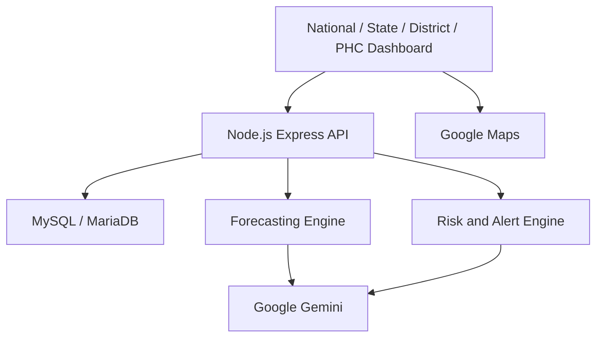

# Bharat Health Grid architecture

AI-Powered Federated Health Resource Intelligence for India

BHG is a React dashboard and an Express API over MariaDB. Forecasting and alerts are deterministic server calculations. Google Gemini explains those results. Google Maps draws the national PHC map in the browser.

## System architecture

The client never imports server code. It calls `VITE_API_BASE_URL`. The API allows that origin through `CLIENT_ORIGIN`.

## Frontend

`client/` is a Vite React application in JavaScript. Ant Design provides the layout, tables, and controls. Recharts draws bed and footfall charts. The national view is India. State, district, and PHC pages replace that view through the existing breadcrumb. The map and the emergency simulation appear only on the India view.

## Backend

`server/src` is an Express application. Routes call controllers. Controllers call services. Services run SQL through a mysql2 pool. AI routes call Gemini only after the relevant service has loaded or received operational data.

## Database

`database/schema.sql` creates `bharat_health_grid` and loads the demonstration seed. The hierarchy is State → District → PHC. Stock is stored by PHC, medicine, and batch. Attendance is stored by personnel, PHC, and date. Footfall is stored by PHC and date. The running application does not alter this schema.

## Forecasting

`forecastService` reads the latest 30 days of `patient_footfall` and aggregated `medicine_stock`. The short-term baseline is the recent 7-day visit average. Trend compares that window with the previous 7 days. The 7-day visit forecast is the recent average times 7. Stock days are current quantity divided by daily usage. Risk bands are CRITICAL at 3 days or less, HIGH at 7, MEDIUM at 14, LOW at 30, and HEALTHY after that.

## Alert engine

`alertService` builds the operational alert list from current stock, expiry, bed occupancy, doctor attendance, and footfall spikes. Forecast alerts are separate. They cover projected medicine stock-out and a rising 7-day visit trend. Both lists are calculated on read. They are not stored as new tables.

## Gemini integration

`server/src/ai` calls the Gemini API with a response schema and checks the JSON before it reaches the client. The five uses are resource risk, redistribution advice, natural-language questions, forecast explanation, and emergency-simulation explanation. Prompts tell the model to use only the supplied data. Unknown facility names are dropped during validation. Gemini has no database credentials and no write path.

## Google Maps

The national map uses `@vis.gl/react-google-maps` and `VITE_GOOGLE_MAPS_API_KEY`. Markers use PHC coordinates from the API, with a small frontend fallback for the seeded centres if a coordinate is missing. Status colours follow the same alert and stock rules as the dashboard. A missing key shows a setup message inside the map card and leaves the rest of the page working.

## Data flow

1. The dashboard requests PHCs, stock, beds, alerts, and state summaries.
2. Drill-down pages aggregate those responses in the browser where the API has no district rollup.
3. Forecast and emergency endpoints calculate from the database in memory and return JSON.
4. An AI button sends that calculated payload, or asks the server to load the current operational snapshot, and displays the validated Gemini response.

## Human approval flow

Redistribution and emergency screens label every suggested transfer as waiting for human approval. The API sets `transfers_executed` to false. There is no endpoint that updates stock, beds, attendance, or footfall from a recommendation or from a simulation.
